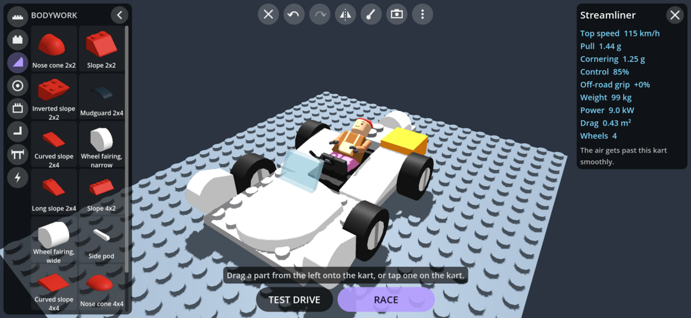
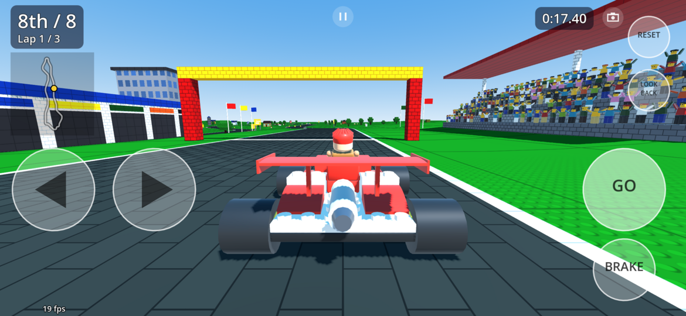
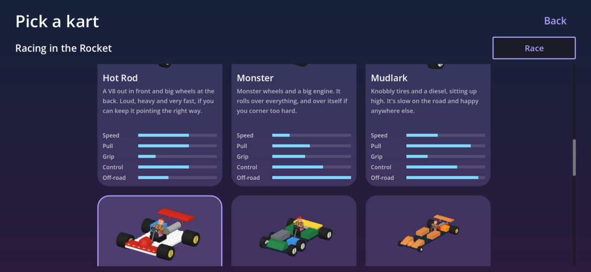
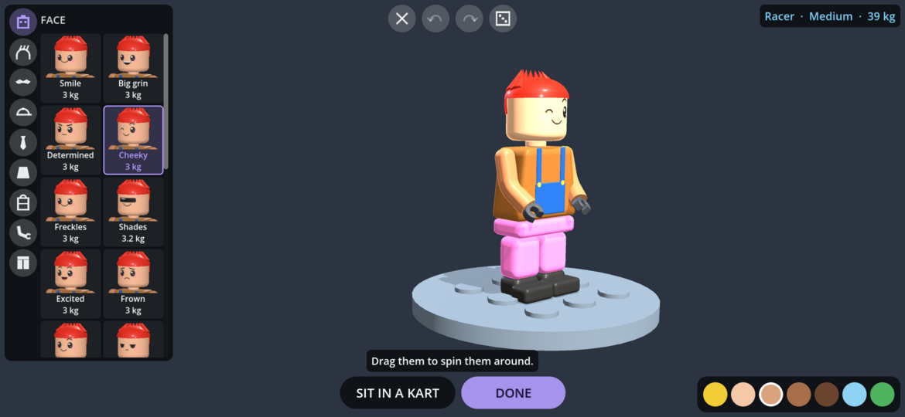

# SnapRacers

SnapRacers is a physics based kart racing game I put together for my son. It requires Android 8.1 or higher.

Build your kart from blocks and race it, customizing and optimizing in your quest to make the ultimate racing machine.
The parts you use matter, adding drag and weight and power, every piece trading one thing to gain another. Crashes knock off parts, 
at least until you hit the reset button (which punishes you lightly).

Race in grand prix cups against a range of AI skills or take it to the streets and race your friends with split screen or network 
multiplayer. Race on the built in tracks or use the track editor to build your own - even assemble your own tournaments!

The game is in a playable state now but there will be plenty of rough edges until they are tested out.

Disclaimer: I am not a programmer and this was made using Claude Opus 5.0/5.5

Cheers,<br>
Dan

---

## Screenshots

<table>
  <tr>
    <td align="center"><br>The garage, with the Streamliner loaded</td>
    <td align="center"><br>The start of a Grand Prix at Peach Pit</td>
  </tr>
  <tr>
    <td align="center"><br>Picking a kart before a race</td>
    <td align="center"><br>Building a driver</td>
  </tr>
</table>

---

## What's in it

### The garage

The garage works like the builder in Apogee, my physics sim. The kart fills the screen and everything else floats over it.

- Drag a part out of the drawer onto the kart, or tap it, then nudge it into place a stud at a time with the arrows.
- Tap a part on the kart to move, turn, copy or delete it.
- Mirror puts every part down on both sides at once.
- Paint any part in sixteen classic brick colours.
- Undo and redo everything, and save as many karts as you like.
- A card in the corner shows how the kart will drive: top speed, pull, cornering, control, off-road grip, weight and drag, and it tells you where most of the drag is coming from.
- Take it straight out for a test drive.

### 57 parts

| | |
|---|---|
| **Plates and bricks** | The frame and body, including wedge plates for a pointed nose. |
| **Bodywork** | Slopes, long slopes, curved slopes, inverted slopes, nose cones, mudguards, wheel fairings and side pods. Put them at the front and the air slides over them, or turn them around to smooth the back. |
| **Wheels** | Nine kinds, from tiny wheels that keep the kart low to monster wheels that go over anything. Slicks grip the road best and hate grass, knobbly tires bite into grass and dirt, and skinny bicycle wheels roll further than anything. |
| **Engines** | Eight: small and big engines, a micro engine, an electric motor that pushes hardest from a standstill, a twin, a diesel that shoves like nothing else, a racing V8, and a jet that pushes the kart along by itself instead of through the wheels. |
| **Cockpit** | An upright seat, a bucket seat and a lay-down seat, a steering wheel, handlebars and a yoke, and windscreens. |
| **Wings** | A spoiler, a front wing and a big rear wing on stilts, for grip in fast corners. |
| **Gadgets** | Turbo, spring, brick dropper, brick cannon, repair kit, shield, ram plate and magnet. You can carry two, and most of them run on studs you pick up on the track. |

### Air and ergonomics

Air resistance comes from the shape of the kart. Looked at from the front, each little square catches wind depending on what the air hits first and what it leaves last. A flat brick face catches all of it, while a slope or nose cone lets it slide past. The driver's in the wind too, unless there's a windscreen in front of them. A wheel out in the open churns up a lot of air, so fairings in front of the wheels help more than anything.

How the driver sits matters. Lying down keeps them out of the wind and the kart low, but it's harder to steer quickly lying down. The steering has to be right in front of the seat, and every stud further they have to reach for it slows their hands.

### Sixteen stock karts

If you'd rather not build, there are sixteen stock karts to pick from before any race, and the AI drivers race in them too. Each AI driver draws one at random at the start of a race, or once for a whole Grand Prix. Around a lap they're all within about seven percent of each other, but they get there in very different ways.

| | |
|---|---|
| **Starter** | A bit of everything. It's a good kart to learn on and to build from. |
| **Featherlight** | Light and low, with tiny wheels at the front and handlebars for quick hands. |
| **Bruiser** | A heavy slab with a diesel and a ram. |
| **Slingshot** | A dragster with a V8 in the back. |
| **Streamliner** | Faired in from nose to tail, with the driver lying down behind the screen. |
| **Mudlark** | Knobbly tires and a diesel, sitting up high. |
| **Trike** | One wheel at the front and an electric motor at the back. |
| **Six-wheeler** | Four small wheels steering at the front. |
| **Monster** | Monster wheels and a big engine. |
| **Rocket** | A jet engine, slicks and wings. |
| **Classic** | A proper go-kart: a flat frame, a little engine and handlebars. |
| **Downforce** | Big wings front and back, and slicks. |
| **Brick Tank** | Two layers of bricks all around, a shield and a repair kit. |
| **Sparky** | An electric all rounder with a magnet for studs. |
| **Hot Rod** | A V8 out in front and big wheels at the back. |
| **Soapbox** | Bicycle wheels, a nose cone and a tiny engine. |

### Drivers

Build your driver from a face, hair, facial hair, headgear, something around the neck, a torso, something on the back, arms and legs, each in its own colours, with a picture of your driver wearing every choice. There are at least twenty of each, from caps, crowns and space helmets to moustaches, capes, shells and wings, so if you want a driver that reminds you of someone from another kart game, you can probably get close. What they wear decides how heavy they are, and a heavier driver makes a steadier kart that's harder to knock around. The seven AI drivers are built the same way.

They're brick minifigs, just a bit cuter, with bigger heads, big shiny eyes and rosy cheeks, all in shiny toy plastic. They blink, look over at karts that pull up beside them, look surprised when they get hit, grin when they pass someone and look cross when they get passed. The winner throws their fists in the air and bounces in the seat. Standing on the driver screen they fidget, look around and wave now and then, and they give a little hop every time you try something new on them.

### Track editor

Build your own courses the way you'd put together a slot car set. Every piece you tap clicks onto the end of the road: straights, bends in three sizes, slants and S bends, humps, ramps and climbing bends for bridges, and the stunts, like the jump, the loop, wall rides, banked sweepers and bends with a shortcut across the middle. Tap a piece of road to take it out, change it to dirt, grass, sand or ice, take its walls off, or add more pieces after it.

When you've had enough, Close it up works out the fewest pieces to bring the road back around to the start without running into itself. A card in the corner says what's still stopping it being raced, like the road not closing or no straight long enough for the grid. Pick a theme for the ground, the colours and the trees, and put landmarks like windmills, castles, rockets and lighthouses wherever you want them around the course.

Saving moves the start line onto your longest straight, where the grid has room, and your course joins the lists for single races, time trials, practice and two player races, with its own records. Each course is one file with everything in it, ready for racing online later.

### Racing

- **Grand Prix:** four cups of four races each, for points and trophies. From the second race on, the leader starts at the back.
- **Your own cups:** put 2 to 8 races together from any courses, the game's and your own, and race them as a Grand Prix with points and trophies. A cup is one file with its courses in it, so it can be shared.
- **Single race:** one race against the AI on any course, including your own.
- **Time trial:** race the clock on any of the sixteen courses, with your best times kept.
- **Practice:** drive any course on your own for as long as you like.
- **Two players on one phone:** side by side in landscape, or face to face in portrait with the phone flat between you and the far half turned around.
- **Six camera views:** close and far chase, first person from your driver's eyes (with their hands on the wheel), a bumper cam, overhead, and TV cameras beside the track. The camera button goes through them and each player's last view is remembered. Hold look back to see who's coming. When you cross the line the camera circles your kart, then the TV cameras take over while the AI drives you home.
- **Four difficulty levels** for the AI drivers, picked before a race or a cup. Easy drivers take it gently, slip up now and then and wait for you. Expert drivers are right on the limit and never let up. Trophies are kept for each level.

### Sound

Everything you hear was made from scratch for the game, by a little synthesiser in `tools/sound`. Nothing's recorded or downloaded.

- **Engines:** each kind of engine has its own sound, from the buzzy little kart engine and the lawnmower micro engine to the lumpy V twin, the clattering diesel, the burbling V8, the whining electric motor and the roaring jet. They rev up as the kart speeds up, and on the grid you can rev yours.
- **Driving:** tires squeal when you slide, there's a rumble on grass and dirt, and the wind picks up as you go faster.
- **Everything else:** knocks and crashes, bricks clattering off, every gadget, studs, the countdown, laps, the finish, and clicks and snaps in the menus and the garage.
- **Music:** a laid back tune for the menus and the garage, and a tune of its own for each cup. I wrote them note by note and the synthesiser plays them.

Music and effects each have their own volume in Settings.

Every course is made of track pieces snapped together on a grid, with hills, crests, jumps, bridges, a loop and plenty of scenery. Each one is based on a real kart circuit.

| Cup | Courses |
|---|---|
| **Baseplate** | Peach Pit, Trulli Turns, Lemon Lake, Pithead Park |
| **Axle** | Delta Dash, Bucketwheel Bend, Foundry Flats, Amber Arc |
| **Gearbox** | Timberline, Frostbite Forest, Dune Drift, Whistlestop Woods |
| **Keystone** | Windmill Ridge, Launchpad Loop, Magma Mile, Castle Keep |

---

## Installing

Download the APK from the [Releases](https://github.com/roge-rm/SnapRacers/releases) page and sideload it. It needs Android 8.1 or newer.

## Playing in a browser

You can play it in a browser too, at [roge-rm.gitlab.io/play/snapracers](https://roge-rm.gitlab.io/play/snapracers/). It's the same game, with the garage, the driver screen, the track editor and every kind of race, and your karts, drivers, courses and records are kept in the browser. Two players can share a keyboard or plug in controllers for split screen. It wants a browser with WebGL 2 (any recent Chrome, Edge, Firefox or Safari).

## Building

SnapRacers is made with the Godot Engine 4.7.2, using the Compatibility renderer and Jolt physics. The build scripts expect a self-contained copy of Godot in `tools/godot`, which isn't in the repo:

- `tools/godot/Godot_v4.7.2-stable_linux.x86_64`, with an empty `._sc_` file beside it so it keeps its settings in `tools/godot/editor_data`
- the 4.7.2 export templates in `tools/godot/editor_data/export_templates/4.7.2.stable`
- the Android SDK and Java 21, set in the editor settings under Export › Android

```sh
tools/build-engine.sh             # our own cut down engine (once, and again for a new Godot)
tools/build-engine.sh --release   # the same, fully optimised, for a release (much slower)
tools/build-android.sh            # the phone APK (arm64)
tools/build-android.sh --install  # the emulator APK (x86_64), installed on the running emulator
tools/build-engine.sh web         # our own cut down engine for the web page
tools/build-web.sh                # the web page, in /tmp/snapracers-build/web
tools/build-web.sh --serve        # the same, served at http://localhost:8060 to try it
```

The phone APK is signed with my release key, which lives outside the repository beside the project in `../Keys`, so anywhere else it's signed with the Android debug key instead.

The web page is built without threads, so it runs on any web host, since a threaded page needs the host to send special headers. Its engine needs [Emscripten](https://emscripten.org), which the build looks for in `~/.local/share/emsdk` (or wherever `EMSDK` says).

`tools/build-engine.sh` builds Godot from source with only what the game uses (the list is in `tools/engine/profile.py`), which makes the APK a lot smaller. It keeps Ogg Vorbis for the music. It needs the Android NDK version Godot asks for and `uv` for installing scons. The finished engine goes in `tools/godot/custom`, and the Android build puts it into the APK. Without it, the build uses the stock engine.

The heavy parts of both builds happen in `/tmp`, because my `/home` is on a slow hard drive. The engine keeps a compile cache there too, so rebuilding it after a small change is quick. `/tmp` is emptied on a reboot, but the finished engine is kept, so it only needs building again for a new version of Godot or a change to the list.

| | |
|---|---|
| Minimum Android | 8.1 (API 27) |
| Engine | Godot 4.7.2, GL Compatibility renderer, Jolt physics |
| ABIs | `arm64-v8a` for phones (a release build), `x86_64` for the emulator (a debug build) |
| Code | GDScript in `scripts`, with parts, karts, drivers and courses as JSON in `data` |
| Sound | Made by `tools/sound/make_sounds.py` into `sound` (see `tools/sound/README.md`) |

## Testing

The tests run headless on the computer and take a few minutes:

```sh
tools/run-tests.sh
```

They check things like:

- the starter kart settles on its wheels, gets up to speed, turns, brakes and resets (`drive_test`)
- the building rules (`design_test`)
- every part can be built and turned, and shapes, windscreens, seats, jets and tires do what they should (`parts_test`)
- a gentle bump costs nothing, a crash at full speed knocks parts off, and a reset puts them back (`damage_test`)
- every course closes into a loop without running into itself (`track_test`)
- a fast kart sticks to the loop all the way around and a slow one drops off (`loop_test`)
- every gadget does what it says (`gadget_test`)
- drivers really do hold the steering wheel and follow it around, and every hat, hairdo, beard and back piece is joined on without poking through anything (`character_test`)
- the garage, the menus and every mode, including a whole Grand Prix and two players on one phone (`garage_test`, `menu_test`, `modes_test`, `split_test`)
- every stock kart gets around a lap with the AI driving (`stock_test`)
- whole races with eight karts, around the loop too (`race_test`)

### Stock karts and courses

`tools/stock-karts` builds the stock karts and times them all against each other. `tools/track-design` turns real kart circuits into brick track pieces. Each has its own README.

---

## Licence

SnapRacers is free software under the **GNU General Public License, version 3 or later**. See [LICENSE](LICENSE).

Copyright © 2026 Dan Hunke.

It's made with the [Godot Engine](https://godotengine.org), which is free and open source under the MIT licence.

The courses are traced from OpenStreetMap map data, which is © OpenStreetMap contributors and available under the Open Database Licence.
