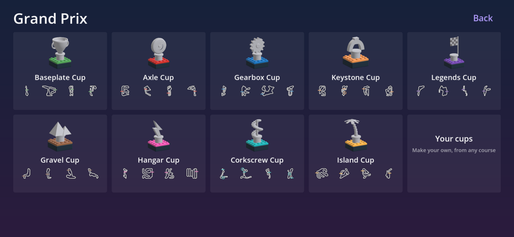
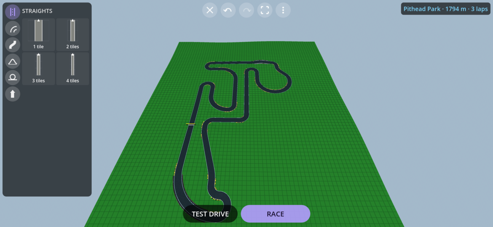

# SnapRacers

SnapRacers is a physics based kart racing game I put together for my son. It requires Android 8.1 or higher.

Build your kart from blocks and race it, customizing and optimizing in your quest to make the ultimate racing machine.
The parts you use matter, adding drag and weight and power, every piece trading one thing to gain another. Crashes knock off parts, 
at least until you hit the reset button (which punishes you lightly).

Race in grand prix cups against a range of AI skills or take it to the streets and race your friends with split screen or network 
multiplayer. Race on the built in tracks or use the track editor to build your own - even assemble your own tournaments!

The game is in a playable state now but there will be plenty of rough edges until they are tested out.

Disclaimer: I am not a great programmer and this was made using Claude Opus 5.0/5.5

Cheers,<br>
Dan

---

## Screenshots

<table>
  <tr>
    <td align="center"><br>Past the crowd at the start of a race at Peach Pit</td>
    <td align="center"><br>The garage, with the Classic loaded</td>
  </tr>
  <tr>
    <td align="center"><br>Every cup with its trophy and courses</td>
    <td align="center"><br>Picking a kart, bike or trike before a race</td>
  </tr>
  <tr>
    <td align="center"><br>Building a driver</td>
    <td align="center"><br>Pithead Park in the track editor</td>
  </tr>
</table>

---

## What's in it

### The garage

The garage works like the builder in Apogee, my physics sim. The kart fills the screen and everything else floats over it.

- Drag a part from the drawer onto the kart and it snaps on wherever its studs, clips, pins or axles fit. Dots show where it can go, and tapping one puts it there.
- Tap a part on the kart to move, turn, flip, slide, copy or delete it, or to change which way on it goes.
- Mirror puts every part down on both sides at once.
- Paint any part in sixteen brick colours.
- Undo and redo anything, and save as many karts as you like. You can start from any of the stock karts too.
- The card in the corner shows top speed, pull, cornering, control, off-road grip, weight and drag, and where most of the drag comes from.
- Take it straight out for a test drive.

### 191 parts

Most of the parts are modelled for the game in `tools/parts`, and they join by their studs, clips, pins and axles the way real bricks do.

| | |
|---|---|
| **Plates** | Thirty-eight, from 1x1 to long and wide chassis plates, with smooth tiles, round plates, a grille and wedge plates for a pointed nose. |
| **Bricks** | Fourteen, from 1x1 to 2x6, with a tall brick, round bricks, a bracket, a brick with a stud on its side, a headlight brick and a heavy ballast brick to keep the kart low. |
| **Curves** | Thirty-six: slopes, curved and inverted slopes, nose cones, bows, wheel arches, mudguards, a racing nose, an engine cowl, a tail fin, wheel fairings, side pods and a ram plate that knocks other karts' parts off. Face them forward and the air slides over them, or turn them around to smooth the back. |
| **Rods and joints** | Twenty-five: bars, clips and handles, beams with holes, pins and axles, axle plates, hinges and ball joints. |
| **Wheels** | Twenty-one, from tiny wheels to monster wheels, with kart wheels and motorbike wheels. Slicks grip the road best and hate grass, knobbly and studded tires bite into grass, dirt and ice, balloon tires float over sand and curbs, and skinny wheels roll the furthest. |
| **Engines** | Thirteen: small and big engines, a micro engine, a rotary, a flat four, a twin, a hybrid, two electric motors, a diesel, a V8, a jet and pedals. Each one sounds different. |
| **Cockpit** | Twenty: seats (upright, racing, bucket and lay-down), a steering wheel, a racing wheel, handlebars, a yoke, a tiller, windscreens and a canopy, with lights, a mirror and an exhaust. |
| **Bikes** | Sixteen: frames for a sports bike, a dirt bike, a cruiser, a scooter and a trike, with forks, a swingarm, a fuel tank, a saddle, bike bars, footpegs and fairings. |
| **Wings** | Eight: spoilers, a ducktail, front wings and big rear wings, single and double. |

### Air and ergonomics

The shape of the kart decides its drag. Seen from the front, a flat brick face catches all the wind and a slope or nose cone lets it slide past. The driver catches wind too unless there's a windscreen in front of them, and open wheels churn up a lot of it, so fairings in front of them help the most.

How the driver sits matters too. Lying down keeps them out of the wind, but they steer more slowly. The steering has to be right in front of the seat, and every stud they have to reach for it slows their hands.

### Stock karts, bikes and trikes

If you'd rather not build, you can pick one of the 22 stock karts, bikes and trikes before any race, and the AI drivers race in them too. Each AI driver gets one at random for a race, or for a whole Grand Prix. They're all within about ten percent of each other around a lap, but they get there in different ways.

| | |
|---|---|
| **Starter** | A bit of everything, good to learn on and to build from. |
| **Featherlight** | Light and low, with skinny front wheels, handlebars and a little rotary engine. |
| **Bruiser** | A heavy slab with a diesel and a ram. |
| **Slingshot** | A dragster with the driver lying down, a V8 in the back and big slicks right at the tail. |
| **Streamliner** | Faired in from nose to tail, with the driver lying down under a bubble. |
| **Mudlark** | Knobbly tires and a diesel, sitting up high. |
| **Six-wheeler** | Four small wheels steering at the front, and a flat four at the back. |
| **Monster** | Monster wheels and a hybrid engine. |
| **Rocket** | A jet engine, slicks and wings. |
| **Classic** | A proper go-kart, with a nose cone, a little engine off to one side and handlebars. |
| **Downforce** | Big wings front and back, and slicks. |
| **Brick Tank** | Thick armour all around and a diesel. |
| **Sparky** | An electric all rounder, quick away from the line. |
| **Hot Rod** | A V8 out in front and big wheels at the back. |
| **Soapbox** | Tall thin wheels, a nose cone and a little rotary engine. |
| **Superbike** | A light sports bike with a fairing and a twin. |
| **Dirt Bike** | Knobbly tires and a light little engine. |
| **Chopper** | Long and low, with a big engine. |
| **Scooter** | Little wheels and a quiet electric motor. |
| **Trike** | One wheel at the front and an electric motor at the back. |
| **Tourer** | A big touring trike with two wheels at the back. |
| **Trikester** | A trike with a knobbly tire up front and two wheels at the back. |

### Power-ups

Every 400 m or so there's a row of giant see-through gold studs right across the road. Drive through one and you get a power-up on one of your two gadget buttons, so you can hold two at once. What you get is random, but the further back you are the better your chances of a strong one, and the leader gets more of the ones for keeping others behind.

| | |
|---|---|
| **Turbos** | A turbo, a big turbo that lasts longer, and a triple turbo with three goes. |
| **Tow rope** | Latches onto the kart ahead and pulls you along behind it for three seconds, then lets go with a burst. |
| **Bricks, walls, marbles and spikes** | Drop a pile of bricks, a brick wall across the road, a scatter of round bricks that roll under the wheels, or a spike trap that slows karts and knocks parts off, behind you for whoever's following. |
| **Shockwave** | Shoves every kart near you away, and knocks parts off any right next to you. |
| **Cannon** | Fires a brick straight ahead, and a homing brick follows the road to the kart in front. Whoever it hits loses a part. |
| **Shield** | Nothing can knock your parts off for four seconds. |
| **Repair kit** | Puts back everything you've lost, without the reset slowdown. |
| **Ghost** | For three seconds you go straight through karts, bricks and traps. |
| **Lightning** | Every kart ahead of you slows right down for two seconds. |

### Drivers

Build your driver from a face, hair, facial hair, headgear, something around the neck, a torso, something on the back, arms and legs, each in its own colours. There are at least twenty of each, from caps, crowns and space helmets to moustaches, capes, shells and wings. What they wear decides how heavy they are, and a heavier driver makes a steadier kart. The seven AI drivers are built the same way.

They're little brick figures, a bit cuter, with bigger heads, shiny eyes and rosy cheeks. They blink, look over at karts beside them, look surprised when they get hit, grin when they pass someone and look cross when they get passed. The winner throws their fists in the air. On the driver screen they fidget, look around, wave now and then and hop when you try something new on them.

### Track editor

Build courses the way you'd put together a slot car set. Each piece you tap clicks onto the end of the road: straights, bends in three sizes, slants and S bends, humps, ramps and climbing bends for bridges, a jump, a loop, wall rides, banked sweepers and bends with a shortcut. Tap a piece of road to take it out, change it to dirt, grass, sand or ice, add or take off walls, or add pieces after it.

Close it up adds the fewest pieces it takes to bring the road back around to the start. The card in the corner says what's still stopping it being raced. Pick a theme for the ground, colours and trees, how hilly it is, and put landmarks like windmills, castles, rockets and lighthouses wherever you like.

Saving moves the start line onto your longest straight, and the course joins the lists for every kind of race, with its own records. Each course is one file, so when you host a game online everyone gets it.

### Sharing courses and cups

Share any course or cup of yours as a code or a file. The code is short enough to paste in a message (a course is about 400 characters), and on a phone both go through the share sheet, so you can send them in any chat app, email or Drive. On a computer the code is copied and the file saved where you like, and on the web the file's downloaded.

To add one you've been sent, use Add a course or Add a cup and paste the code or open the file. A cup brings its own courses with it, so you can race each of them on their own too. Something you've already got isn't added twice. If you race someone else's course or cup online, Keep in the lobby adds it to yours.

### Courses

Every course is based on a real circuit, with laps of 1.6 to 1.9 km and a road wide enough for three karts through a bend. Kart circuits are made as big for the karts as the real one is for real karts, and the famous race tracks in the Legends Cup are shrunk down to the same lap size. The Gravel Cup is rallycross, on real rallycross circuits that are part tarmac and part gravel. The Hangar Cup is indoors, on real indoor kart tracks made bigger, in halls with barriers all the way around, rows of lights overhead, and one that goes over itself on an upper deck. The Corkscrew Cup is traced from real roller coasters, up high on coaster supports, with big drops, airtime hills and corkscrews that turn you upside down. The Island Cup is by the sea on four islands, with the beach and the boats out on the water beside you. They're made of track pieces snapped together on a grid, with crests, jumps, bridges, a loop and plenty of scenery.

The road runs out onto grass that slows you down, and there are only walls where you'd fall off. The corners have red and white curbs you can ride, but at speed they bounce your wheels into the air. Where two bits of road run close together there are soft tire stacks between them. The ground rolls in gentle hills, a little by the lakes and a lot in the mountains.

The scenery breaks. Drive through a tree, a fence or a billboard and it comes down in pieces, and a crash into a house or the grandstand knocks a hole in it. The loose bricks stay where they land until the race is over, and you can push them about, so the places people crash fill up with rubble. A hard hit on a tire stack knocks its top tires off, but the bottom ones stay, so you still can't cut across.

There's a crowd. Little brick figures fill the grandstands and stand along the fence at some corners, and they jump up and wave their arms as you go by. Windmills and wind turbines turn, flags wave, the big wheel and the carousel go around, cranes swing and the boats rock on the water.

| Cup | Courses |
|---|---|
| **Baseplate** | Peach Pit, Trulli Turns, Lemon Lake, Pithead Park |
| **Axle** | Delta Dash, Bucketwheel Bend, Foundry Flats, Amber Arc |
| **Gearbox** | Timberline, Frostbite Forest, Dune Drift, Whistlestop Woods |
| **Keystone** | Windmill Ridge, Launchpad Loop, Magma Mile, Castle Keep |
| **Legends** | Royal Run, Dry Lagoon, Sakura Swirl, Rouge Ridge |
| **Gravel** | Menhir Meadow, Oast Hill, Devil's Dust, Pine Hill Leap |
| **Hangar** | Neon Nights, Hairpin Hall, Bohemian Bends, Spark Deck |
| **Corkscrew** | Serpent Summit, Lakeshore Plunge, Red Rocket, Twister Pines |
| **Island** | Windsurf Way, Coral Cove, Blue Lagoon, Penguin Point |

### Racing

- **Grand Prix:** nine cups of four races each, for points and trophies. From the second race on, the leader starts at the back. All the cups are on one screen, each with its own brick trophy and the layouts of its courses. A trophy's grey until you finish in the top three, then it's gold, silver or bronze.
- **Your own cups:** put 2 to 8 races together from any courses and race them as a Grand Prix. A cup is one file with its courses in it, so it can be shared.
- **Single race:** one race against the AI on any course. Pick a cup, then one of its courses.
- **Time trial:** race the clock, with your best times kept.
- **Practice:** drive any course on your own for as long as you like.
- **Two players on one phone:** side by side in landscape, or face to face in portrait with the phone flat between you. Each player picks a kart and gives their name in turn, and one map sits on the line between the halves.
- **Six camera views:** close and far chase, first person from your driver's eyes, a bumper cam, overhead and TV cameras beside the track. Hold look back to see who's coming. After the finish the camera circles your kart and the AI drives you home.
- **Sliding:** while steering, hold the gas and brake together, or slide your thumb from GO down onto the brake and back up, to kick the tail out. Keep the gas on and keep steering into the bend and the slide holds, with the tail out further the harder you steer. Straighten up or let go of the gas and it grips again. A held slide keeps its speed around a hairpin better than braking for it, but the longer you hold it the more it scrubs off. Hold it at least half a second and straighten up out of it with the gas still on and you get a little turbo, longer the longer you held it. Expert drivers slide too.
- **A menu in races,** from the button in the corner or Start on a controller. In a race on your own it pauses everything, and in split screen each player has their own while the race carries on.
- **Four AI levels,** picked before a race or a cup. Easy drivers take it gently, slip up now and then and wait for you. Expert drivers are right on the limit. Trophies are kept for each level.

### Controllers and keys

Everything works with a controller or the keys as well as touch: the menus, races, the garage, the driver screen and the track editor. In Settings each player picks their own controller, and sets their own keys and buttons by tapping one and pressing the new one.

### Online

Race people on other phones, up to eight karts, with AI drivers in the empty places if the host wants them. The host picks one race or a whole cup and it's sent to everyone. Two players on one phone can go online together on a split screen.

- **The same Wi-Fi:** one phone hosts and the game shows up on the others by itself.
- **A hotspot:** turn on one phone's hotspot, join it with the others and host on that phone.
- **Wi-Fi Direct:** no router or hotspot needed. One phone hosts over Wi-Fi Direct and the others use Find Wi-Fi Direct games.
- **Bluetooth:** for two or three phones with no Wi-Fi at all. Pairing them first makes it quicker.
- **A server:** a SnapRacers server runs races by itself, on your network or on the internet, in Docker with an admin page. Browsers can join one too, which is the only way to race online from the web version. See [server/README.md](server/README.md).

"How do I connect?" at the bottom of the online screen goes through all of it.

### Sound

Everything you hear was made for the game by a little synthesizer in `tools/sound`. Nothing is recorded or downloaded.

- **Engines:** each kind of engine has its own sound, from the buzzy little kart engine to the clattering diesel, the burbling V8, the whining electric motor and the roaring jet. You can rev yours on the grid.
- **Driving:** tires squeal when you slide, grass and dirt rumble, and the wind picks up as you go faster.
- **Everything else:** knocks and crashes, bricks clattering off, every power-up, the countdown, laps, the finish and the clicks in the menus and the garage.
- **Music:** a laid back tune for the menus and a tune for each cup. I wrote them note by note and the synthesizer plays them.

Music and effects each have their own volume in Settings.

---

## Installing

The easiest way to install SnapRacers and keep it up to date is through my F-Droid repo:

[https://roge-rm.gitlab.io/repo](https://roge-rm.gitlab.io/repo?fingerprint=80438B253C257BCCE05CDCB9E3AC9B6174C2250659962B14FCBE7F32FD42D53E)

Then search for SnapRacers in F-Droid. When a new version comes out, F-Droid will offer it as an update.

You can also download the APK from the [Releases](https://github.com/roge-rm/SnapRacers/releases) page and sideload it. It needs Android 8.1 or newer.

## Playing in a browser

You can play it in a browser at [roge-rm.gitlab.io/play/snapracers](https://roge-rm.gitlab.io/play/snapracers/). It's the same game, and your karts, drivers, courses and records are kept in the browser. Two players can share a keyboard or plug in controllers. It needs a browser with WebGL 2, which any recent Chrome, Edge, Firefox or Safari has.

## Building

SnapRacers is made with Godot 4.7.2, using the Compatibility renderer and Jolt physics. The build scripts expect a copy of Godot in `tools/godot`, which isn't in the repo:

- `tools/godot/Godot_v4.7.2-stable_linux.x86_64`, with an empty `._sc_` file beside it so it keeps its settings in `tools/godot/editor_data`
- the 4.7.2 export templates in `tools/godot/editor_data/export_templates/4.7.2.stable`
- the Android SDK and Java 21, set in the editor settings under Export › Android

```sh
tools/build-engine.sh             # our own cut down engine (once, and again for a new Godot)
tools/build-engine.sh --release   # the same, fully optimised, for a release (much slower)
tools/build-android.sh            # the phone APK (arm64)
tools/build-android.sh --install  # the emulator APK (x86_64), installed on the running emulator
tools/build-engine.sh web         # our own cut down engine for the web page
tools/build-web.sh                # the web page, in build/web
tools/build-web.sh --serve        # the same, served over HTTPS on port 8060 to try it
tools/build-plugin.sh             # the Android network plugin (build-android.sh does this when it's needed)
tools/build-server.sh --run       # the dedicated server, to run on this PC (Docker's in server/)
```

The Android network plugin in `android-plugin` is a little Kotlin library for finding games with NSD, Wi-Fi Direct and Bluetooth. It's built with the Gradle from Godot's Android build template, and `addons/snapracers_net` puts it into the APK.

The phone APK is signed with my release key, which lives beside the project in `../Keys`. Anywhere else it's signed with the Android debug key.

The web page is built without threads so it runs on any web host. Its engine needs [Emscripten](https://emscripten.org), which the build looks for in `~/.local/share/emsdk` or wherever `EMSDK` says.

`tools/build-engine.sh` builds Godot from source with only what the game uses (the list is in `tools/engine/profile.py`), which makes the APK a lot smaller. It needs the Android NDK version Godot asks for and `uv` for installing scons. The finished engine goes in `tools/godot/custom` and the Android build puts it into the APK. Without it, the build uses the stock engine.

Everything the builds make goes in `build/`, which git ignores. The engine keeps a compile cache there too, and the finished engine is kept in `tools/godot/custom`, so it only needs building again for a new Godot or a change to the list.

| | |
|---|---|
| Minimum Android | 8.1 (API 27) |
| Engine | Godot 4.7.2, GL Compatibility renderer, Jolt physics |
| ABIs | `arm64-v8a` for phones (a release build), `x86_64` for the emulator (a debug build) |
| Code | GDScript in `scripts`, with parts, karts, drivers and courses as JSON in `data` |
| Sound | Made by `tools/sound/make_sounds.py` into `sound` (see `tools/sound/README.md`) |

## Testing

The tests run headless on the computer and take a while, since some race in real time:

```sh
tools/run-tests.sh
```

They check things like:

- the starter kart settles on its wheels, gets up to speed, turns, brakes and resets (`drive_test`)
- the building rules (`design_test`)
- every part can be built and turned, and shapes, windscreens, seats, jets and tires do what they should (`parts_test`)
- a gentle bump costs nothing, a crash at full speed knocks parts off and a reset puts them back (`damage_test`)
- small scenery comes down whole, buildings only where they're hit, tire stacks keep their bottom tire, a kart driving into something small knocks it down and keeps going, flags flap until they're knocked down and the crowd cheers as a kart goes by (`damage_world_test`)
- every course closes into a loop without running into itself (`track_test`)
- a fast kart sticks to the loop all the way around and a slow one drops off (`loop_test`), and the same on a corkscrew (`corkscrew_test`)
- bikes and trikes stay upright, lean into bends the right way and don't tip over in a hard turn (`bike_test`)
- every power-up does what it says, the boxes hand them out and the karts at the back get the strong ones more often (`gadget_test`)
- a faster kart gets past one it's racing wheel to wheel, instead of their wheels hooking together (`wheels_test`)
- the AI steers round a brick wall across its line, and resets when it loses a wheel (`ai_wall_test`)
- gas and brake together slide the kart around a bend tighter than steering alone, a slide held on the gas keeps going with the tail out steadily without spinning, and it grips again once you straighten up with a little turbo for holding it (`drift_test`)
- drivers hold the steering wheel, and every hat, hairdo, beard and back piece is joined on without poking through anything (`character_test`)
- the garage, the menus and every mode, including a whole Grand Prix and two players on one phone (`garage_test`, `menu_test`, `modes_test`, `split_test`)
- the track editor used the way a player would, and what stops a course being raced (`editor_test`, `course_test`)
- a course or cup goes to a share code and back the same, even split over lines in a message, a tampered one is turned away, and adding one never makes a second copy (`sharing_test`)
- each player's keys and controller buttons, the menus with a controller, and the menu in a race (`bindings_test`, `focus_test`, `pause_test`)
- every camera view looks where it should (`camera_test`), every sound is there (`sound_test`), and the cups' trophies hold together (`trophy_test`)
- every stock kart gets around a lap with the AI driving (`stock_test`)
- each AI level laps about as far behind Expert as it should (`difficulty_test`)
- whole races with eight karts, around the loop too (`race_test`)
- curbs throw you in the air at speed, grass slows you without stopping you dead, tire stacks bounce you back and there are no walls beside the road (`runoff_test`)
- a game over Bluetooth with a pretend radio (`bluetooth_test`)
- two copies of the game racing each other over the network, a race and then a cup (`tools/run-net-test.sh`)
- the dedicated server, with one player joining like a phone and one like a web page, and its admin page (`tools/run-server-test.sh`, which also works on a server running in Docker with `--running`)

### Stock karts and courses

`tools/stock-karts` builds the stock karts and times them against each other, and `tools/track-design` turns real circuits into track pieces. Each has its own README.

---

## Licence

SnapRacers is free software under the **GNU General Public License, version 3 or later**. See [LICENSE](LICENSE).

Copyright © 2026 Dan Hunke.

It's made with the [Godot Engine](https://godotengine.org), which is free and open source under the MIT licence.

The courses are traced from OpenStreetMap map data, which is © OpenStreetMap contributors and available under the Open Database Licence.
